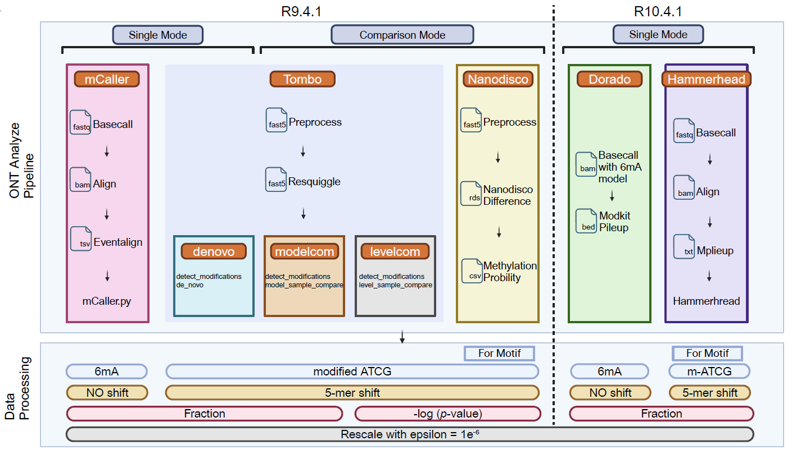

# TGS-comparison-for-bacteria-6mA

This GitHub repository contains all the custom scripts and shell commands used in our paper, **Comprehensive Comparison of Third-Generation Sequencing Tools for Bacteria 6mA Profiling**.

## Graphic abstract

## Data available
Because Oxford Nanopore's basecall model is updated frequently, we recommend using the latest basecaller model for re-calling.All raw signal files are uploaded to the NCBI (BIOPROJECT:[PRJNA1119015](https://ncbi.nlm.nih.gov/bioproject/?term=PRJNA1119015))

## Code available

**Notes:** The scripts are ordered according to their appearance in the figures.

### Envs

Mandatory software:

| Name         | Version | Source|
|:-------------|:--------|:--------|
| **samtools** | v1.17   |conda|
| **minimap2** | v2.17   |conda|
| **nanoCEM**  | 0.0.5.8 |Pypi|
| **plotnine** | 0.9.1   |Pypi|

Optional

| Name            | Version | Source|
|:----------------|:--------|:--------|
| **tombo**       | v1.5    |conda|
| **nanopolish**  | v1.14.1 |conda|
| **harmmerhead** | 0.1.3   |Pypi|

