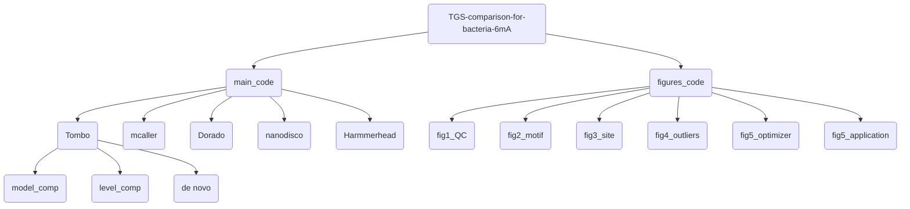

# TGS-comparison-for-bacteria-6mA

This GitHub repository contains all the custom scripts and shell commands used in our paper, **Comprehensive Comparison of Third-Generation Sequencing Tools for Bacteria 6mA Profiling**.

## Graphic abstract

## Data available
Oxford Nanopore's basecall model is updated frequently, we recommend using the latest basecaller model for re-calling. All raw signal files are uploaded to the NCBI (BIOPROJECT:[PRJNA1119015](https://ncbi.nlm.nih.gov/bioproject/?term=PRJNA1119015)).

## Code available

**Notes:** We highly recommend creating a separate conda environment to manage the following software tools.

### Envs

Mandatory software:

| Name         | Version  | Source|
|:-------------|:---------|:--------|
| **samtools** | v1.17    |conda|
| **minimap2** | v2.17    |conda|
| **python**   | \>=3.9.2 |conda|
| **nanoCEM**  | 0.0.5.8  |Pypi|
| **h5py**  | 3.8.0  |Pypi|
| **pod5**  | 0.2.4  |Pypi|
| **Samtools**  | 1.17  |conda|
| **SeqKit**  | 2.6.1  |conda|
| **ont-fast5-api**  | 4.1.1  |Pypi|
| **slow5tools**  | 1.2.0  |Pypi|
| **memes**  | 1.8.0  |R|
| **Giraffe**  | 0.1.0.14  |Pypi|

Nanopore tools:

| Name            | Version | Source|
|:----------------|:--------|:--------|
| **Tombo**       | v1.5    |conda|
| **Nanopolish**  | v1.14.1 |conda|
| **Hammerhead** | 0.1.3   |Pypi|
| **Dorado**  | 0.5.0  |conda|
| **mCaller**  | 0.0.5.8  |Pypi|

### Structure

### main_code
#### Nanopore_tools_code
Here are all the shell commands used to obtain the bacterial 6mA predictions using all seven Nanopore tools.
For each sample, we run the commands in [QC.sh](main_code/QC.sh). The basecalled **fastq** file and the alignment result (**bam** file) with the reference can be collected,
while giraffe will help to calculate the estimated features such as Q score and read length.

Additionally, for Tombo, we developed [read_tombo.py](main_code/Nanopore_tools_code/read_tombo.py) to merge the result from `tombo text_output` and output a **bed** file.

    Usage: read_tombo.py [-h] [-t TOMBO_RESULT] [--ref REF] [--output OUTPUT]
    optional arguments:                                                      
      -h, --help            show this help message and exit                  
      -t TOMBO_RESULT, --tombo_result TOMBO_RESULT                       
                            suffix of tombo result                           
      --ref REF             reference path                                   
      --output OUTPUT       output path   

#### R markdown files
We show the main code of our work, entitled [psph_wt.Rmd](main_code/psph_wt.Rmd), [psph_mu.Rmd](main_code/psph_mu.Rmd), [psph_lost.Rmd](main_code/psph_lost.Rmd), [pst.Rmd](main_code/pst.Rmd), [psph_optimization.Rmd](main_code/psph_optimization.Rmd), and [psph_dorado_downsample.Rmd](main_code/psph_dorado_downsample.Rmd).
In each Rmd, we recommend the reading following the **Outline**.
For example in [psph_wt.Rmd](main_code/psph_wt.Rmd). 
1. We need to load the output files from all seven tools and trim them into a unified format with assigned values (detailed in the Methods section).
2. The codes of assigned values distribution plot are provided to visulaize the outputs (SF. 1c).
3. Meme-Streme for motif discovery. Plot codes are provided (Fig. 6, SF. 2-4).
4. _Psph_ motifs' features were characterized (Fig. 2b).
5. **Sites comparison** is one of the core sections of our study, including "5-mer shift", "compare tools with A sites", and "compare tools with ATCG sites". Codes are provided and detailed description can be found in Methods section. Codes for plotting F1 score change curve, PRC, and ROC curve are provided.
6. Outliers analysis.
7. Detailed comparison of Nanopore and SMRT results.

### figures_code
We present the additional codes for the figures plot.

#### Showcase of the current
After obtaining many modification sites, 
we used [nanoCEM](https://github.com/lrslab/nanoCEM) to showcase the analysis focusing on current and alignment feature, the commands are saved in [nanocem.sh](figures_code/SF5/nanocem.sh)
